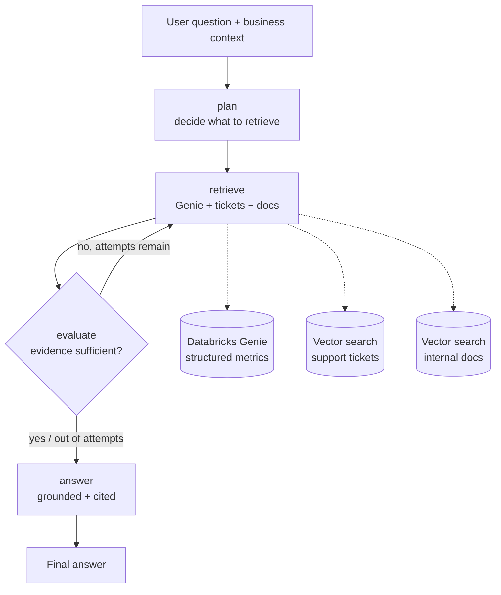

# Nimbus Analytics: Company Intelligence AI Agent

A self-correcting **LangGraph** agent that answers strategic business questions by
grounding every claim in real company data - structured metrics, support tickets,
and internal documents - retrieved live from **Databricks** over MCP. Wrapped in a
minimal Streamlit interface that renders a flow diagram and a branded PDF report
for each answer.

<p align="center">
  
  
  
  
  
  
</p>

---

## What it does

Nimbus Analytics is a fictional B2B SaaS company facing four real business
problems: SMB churn after a price increase, loss of trust after a product
incident, no early warning for at-risk accounts, and growth that leans too hard
on raising prices. This agent answers questions about those problems the way an
analyst would - by pulling the actual numbers, reading the actual tickets, and
citing what it found.

Ask something like *"Why did SMB churn spike in Q3 2025?"* and the agent will:

1. **Plan** what data it needs (metrics, ticket text, documents, or a mix).
2. **Retrieve** from three live Databricks sources in parallel.
3. **Evaluate** whether the evidence is actually strong enough to answer well.
4. **Self-correct** - if the evidence is thin, it rewrites its own query and
   retrieves again (up to a bounded number of attempts).
5. **Answer** with a grounded response that cites specific numbers, ticket IDs,
   document titles, and dates - and says so honestly when the evidence is weak.

## Key features

- **Self-correcting retrieval loop.** An evaluator node judges evidence
  sufficiency and can send the agent back to retrieve with a refined query,
  instead of answering from thin context. Bounded to avoid infinite loops.
- **Grounded, cited answers.** The answer prompt is constrained to use only
  retrieved evidence, cite specifics, and admit uncertainty rather than invent.
  Retrieved ticket and document text is treated as reference data, not
  instructions (prompt-injection aware).
- **Three live data sources over MCP.** Databricks Genie for
  natural-language-to-SQL metrics, plus two vector-search indexes for support
  tickets and internal documents.
- **Bring-your-own context.** A business-context document rides along with every
  question as a removable chip; remove it and upload your own PDF, DOCX, TXT, or
  MD instead.
- **Auto-generated flow diagram.** Each answer is turned into a small, ordered
  flow diagram (rendered locally, or on a real Excalidraw board when the
  Excalidraw MCP is connected).
- **One-click PDF report.** A compact, branded report with the flow diagram, the
  question, and the grounded answer, dated in both the header and the filename.

## Architecture



The agent graph (`plan -> retrieve -> evaluate -> answer`) is built with LangGraph
and a `MemorySaver` checkpointer. The `evaluate -> retrieve` back-edge is the
self-correcting loop. The Streamlit app is a thin UI layer over the compiled
agent: it imports `build_agent()` and invokes it without modifying the agent.

### Tech stack

| Layer | Technology |
| --- | --- |
| Orchestration | LangGraph (stateful graph, conditional edges, checkpointer) |
| Reasoning | OpenAI GPT-4o |
| Retrieval | Databricks Genie + Vector Search, accessed over the Model Context Protocol (MCP) |
| Interface | Streamlit (multipage), custom paper/retro theme |
| Diagrams | Pillow (local render) or Excalidraw MCP |
| Reports | fpdf2, PyMuPDF / python-docx for reading uploaded context |

## Project structure

```
nimbus-agent/
  agent.py                 # LangGraph agent: plan -> retrieve -> evaluate -> answer
  agent_state.py           # Typed AgentState shared across graph nodes
  retrieval.py             # Genie + vector-search calls (sync wrappers)
  mcp_tools.py             # MCP tool discovery helper
  app.py                   # Streamlit interface: composer + insights pages
  diagram.py               # Answer -> flow spec -> PNG / Excalidraw board
  assets/
    business_context.pdf   # Preloaded business context (rides with every question)
  .streamlit/config.toml   # Light paper theme
  requirements.txt         # Pinned dependencies
  Procfile, runtime.txt    # Deployment (web dyno + Python version)
  EXCALIDRAW_MCP_SETUP.md  # How to connect a real Excalidraw MCP server
```

## Getting started

### Prerequisites

- Python 3.13
- An OpenAI API key
- Databricks workspace access with a Genie space and vector-search indexes
  (the retrieval layer targets `nimbus/silver` tickets and docs indexes)

### Install

```bash
python -m venv venv
.\venv\Scripts\pip.exe install -r requirements.txt   # Windows
# source venv/bin/activate && pip install -r requirements.txt   # macOS / Linux
```

### Configure

Create a `.env` file in this folder:

```env
OPENAI_API_KEY=sk-...
DATABRICKS_HOST=https://<your-workspace>.cloud.databricks.com
DATABRICKS_TOKEN=dapi...
GENIE_SPACE_ID=<your-genie-space-id>

# Optional: connect a real Excalidraw MCP server (see EXCALIDRAW_MCP_SETUP.md)
EXCALIDRAW_MCP_URL=http://localhost:3000/mcp
```

`OPENAI_API_KEY` powers both the agent's reasoning and the answer-to-diagram
step. The Databricks keys are required for retrieval.

### Run the agent on its own

```bash
.\venv\Scripts\python.exe agent.py
```

This runs a sample question (`"How can we reduce SMB churn?"`) end to end and
prints the plan, the retrieval attempts, the evaluator's verdict, and the final
grounded answer - useful for verifying your Databricks and OpenAI wiring.

### Run the web app

```bash
.\venv\Scripts\streamlit.exe run app.py
```

Type a question (or open **need a starting point?** for samples), keep or remove
the preloaded business context, and click **Ask the Agent**. The app moves to the
insights page, runs the agent, and shows the grounded answer, the reasoning
trace, the flow diagram, and a downloadable PDF report.

## The self-correcting loop, in detail

The evaluator node returns a small JSON verdict:

```json
{ "sufficient": false, "reason": "No churn figures for Q3 were retrieved", "refined_query": "SMB churn rate by month Q3 2025" }
```

If `sufficient` is `false` and attempts remain, `should_retry` routes back to
`retrieve` using `refined_query` - so the agent improves its own search instead
of answering from weak evidence. If the verdict can't be parsed, it defaults to
sufficient to avoid looping forever. Retrieval attempts are capped
(`MAX_ATTEMPTS`).

## Data sources (Databricks over MCP)

Retrieval talks to Databricks-hosted MCP servers:

- **Genie** (`/api/2.0/mcp/genie/<space>`) - natural-language questions against
  structured metrics, with an async poll loop until the answer completes.
- **Vector search** (`/api/2.0/mcp/vector-search/nimbus/silver`) - semantic
  search over the `tickets` and `docs` indexes.

Each retrieval call is wrapped so a failure in one source degrades gracefully
(the error is captured as that source's result) rather than crashing the run.

## Flow diagram and the Excalidraw MCP

`diagram.py` turns each answer into a 3-6 step flow spec and renders it. By
default it draws a clean paper-styled PNG locally so the page and PDF work out of
the box. Set `EXCALIDRAW_MCP_URL` (and run an Excalidraw MCP server) to render on
a real Excalidraw board instead - see [EXCALIDRAW_MCP_SETUP.md](EXCALIDRAW_MCP_SETUP.md).
New connectors can be added by appending to the `CONNECTORS` list in `app.py`.

## Deployment

A `Procfile` and `runtime.txt` are included for platforms that run Python web
dynos (Heroku, Railway, Render):

```
web: streamlit run app.py --server.port=$PORT --server.address=0.0.0.0 --server.headless=true
```

Set the same environment variables in your host's config. Never commit `.env` -
it is already in `.gitignore`.

## Notes

- The agent run and the Excalidraw MCP connection require live Databricks /
  OpenAI / MCP access, so they run in your environment.
- All source is ASCII only (no em dashes), matching the project style.
- Nimbus Analytics is a fictional company used as a realistic demo scenario.
